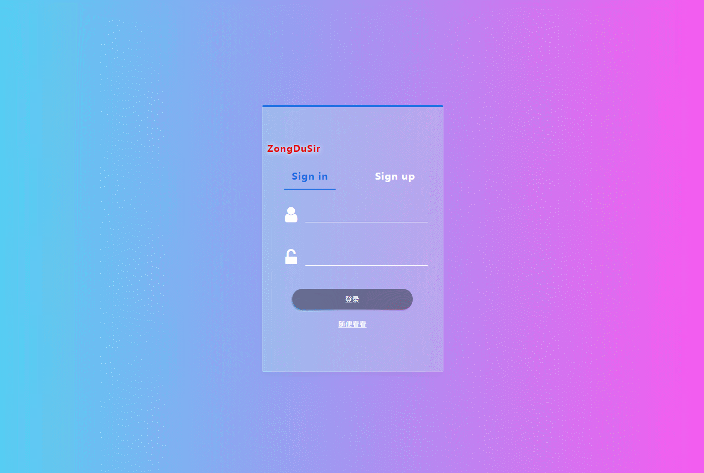

# Vue2.0 + Bmob

> A Vue.js project

## Build Setup

``` bash
## install dependencies
npm install

## serve with hot reload at localhost:8081
npm run dev
```

在线演示地址：[http://www.zongdusir.top/bmob-blog/dist/index.html#/](http://www.zongdusir.top/bmob-blog/dist/index.html#/)

```
## Maybe you need these

Sass

NProgress

Vuex

Vue-Router

ES6

sass-resources-loader

font-awesome

font-awesome-animation

wangEditor

```

### 主要实现的功能

[✔] 登录帐号 (真实登录)

[✔] 注册帐号

[✔] 自制 `通用桌面提示组件`

[✔] 不需要登录进入首页 (随便看看)

[✔] 首页文章显示

[✔] 自制 `首页底部滚动 无限刷新数据`

[✔] Tab 切换文章分类

[✔] 登录后退出

[✔] 响应式制作

[✔] 点击文章查看内容

[✔] 文章评论 (需要登录)

[✔] 修改文章

[✔] 编辑文章

[✔] 查看个人信息

[✔] 编辑个人信息

[✔] 发表文章

[✔] 有些人爱捣乱，部分加了权限

后续：

[✖] 头像更换

[✖] 文章点赞


## 数据真实保存



（录的有点卡）

2018 - 1 - 21


For a detailed explanation on how things work, check out the [guide](http://vuejs-templates.github.io/webpack/) and [docs for vue-loader](http://vuejs.github.io/vue-loader).
